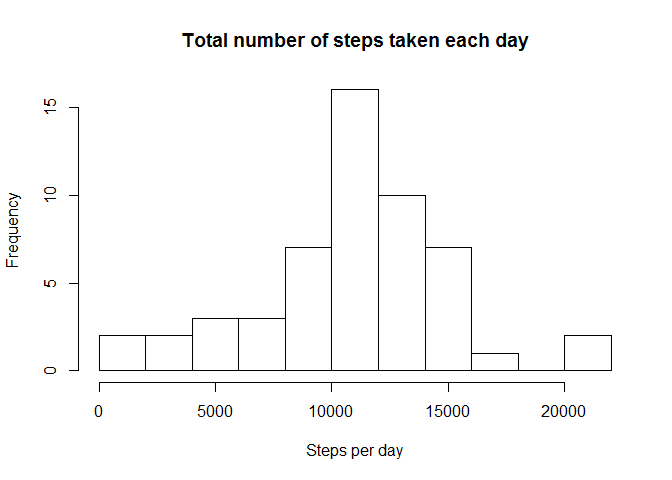
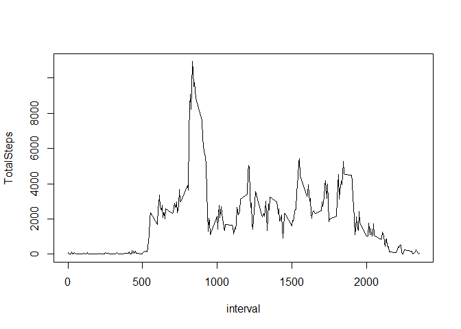
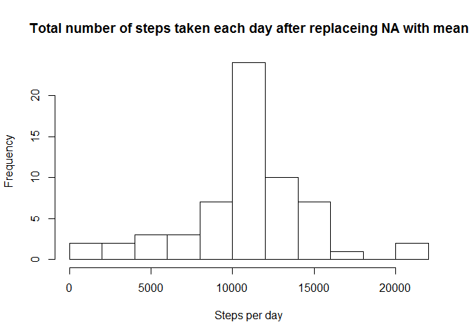
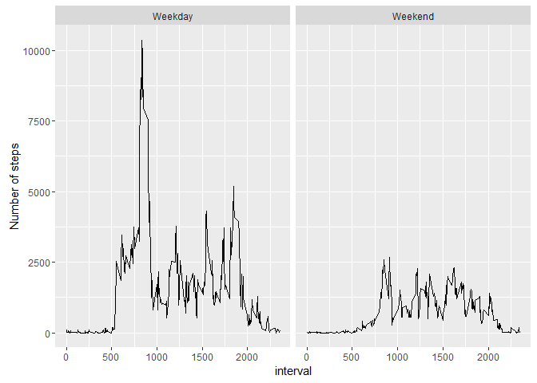

# Reproducible Research: Peer Assessment 1


## Loading and preprocessing the data
* Loading required packages

```r
library(dplyr)
library(xtable)
library(ggplot2)
```
* Loading the unzipped data file and transform date column as Date class.

```r
Data <- read.csv("activity.csv")
Data$date <- as.Date(Data$date,format="%Y-%m-%d")
```

## What is mean total number of steps taken per day?

```r
NoStepsPerDay <- group_by(Data,date) %>%
                 summarise(TotalSteps = sum(steps))


hist(NoStepsPerDay$TotalSteps 
     ,main = "Total number of steps taken each day"
     ,xlab = "Steps per day"
     ,breaks = 10)
```

<!-- -->

```r
xt <- xtable(data.frame(Mean_no._steps_per_day = mean(NoStepsPerDay$TotalSteps,na.rm = TRUE),
           Median_no._steps_per_day = median(NoStepsPerDay$TotalSteps,na.rm = TRUE)),auto = TRUE)

print(xt, type = "html",
      sanitize.colnames.function=function(x)gsub("\\_"," ",x),include.rownames = FALSE)
```

<!-- html table generated in R 3.3.1 by xtable 1.8-2 package -->
<!-- Fri Dec 02 15:52:06 2016 -->
<table border=1>
<tr> <th> Mean no. steps per day </th> <th> Median no. steps per day </th>  </tr>
  <tr> <td align="right"> 10766.18867925 </td> <td align="right"> 10765 </td> </tr>
   </table>


## What is the average daily activity pattern?

```r
NoStepsPerInterval <- group_by(Data,interval) %>%
  summarise(TotalSteps = sum(steps, na.rm = TRUE))

plot(NoStepsPerInterval, type = "l")
```

<!-- -->

```r
MaxStepsInterval <- NoStepsPerInterval[which.max(NoStepsPerInterval$TotalSteps),"interval"]
```
The 835-th 5-minute interval contains the maximum number of steps.


## Imputing missing values

```r
NoRowMissingData <- sum(!complete.cases(Data))
```
There are 2304 rows with NA´s in the dataset.

NA's är replaced with the mean from that particular interval.

```r
DataImp <- Data %>%
  group_by(interval) %>%
  mutate(
    steps = ifelse(is.na(steps),mean(steps, na.rm = TRUE), steps)  
  )

NoStepsPerDayImp <- group_by(DataImp,date) %>%
                 summarise(TotalSteps = sum(steps))


hist(NoStepsPerDayImp$TotalSteps 
     ,main = "Total number of steps taken each day after replaceing NA with mean"
     ,xlab = "Steps per day"
     ,breaks = 10)
```

<!-- -->

```r
xt <- xtable(data.frame(Mean_no._steps_per_day = mean(NoStepsPerDayImp$TotalSteps,na.rm = TRUE),
           Median_no._steps_per_day = median(NoStepsPerDayImp$TotalSteps,na.rm = TRUE)),auto = TRUE)

print(xt, type = "html",
      sanitize.colnames.function=function(x)gsub("\\_"," ",x),include.rownames = FALSE)
```

<!-- html table generated in R 3.3.1 by xtable 1.8-2 package -->
<!-- Fri Dec 02 15:52:06 2016 -->
<table border=1>
<tr> <th> Mean no. steps per day </th> <th> Median no. steps per day </th>  </tr>
  <tr> <td align="right"> 10766.18867925 </td> <td align="right"> 10766.18867925 </td> </tr>
   </table>
The new dataset has the same mean as before but the median has changed to the mean. The histogram clearly shows the change in distribution.

## Are there differences in activity patterns between weekdays and weekends?

```r
Sys.setlocale("LC_ALL","English")

DataImp$weekpart <- as.factor(ifelse(weekdays(DataImp$date) %in% c("Saturday","Sunday"),"Weekend","Weekday"))

StepsByIntervalAndWeekpart <- DataImp %>%
                              group_by(interval,weekpart) %>%
                              summarise(steps = sum(steps))

qplot(interval, steps, data = StepsByIntervalAndWeekpart, facets = .~weekpart, ylab = "Number of steps", geom = "line")
```

<!-- -->
